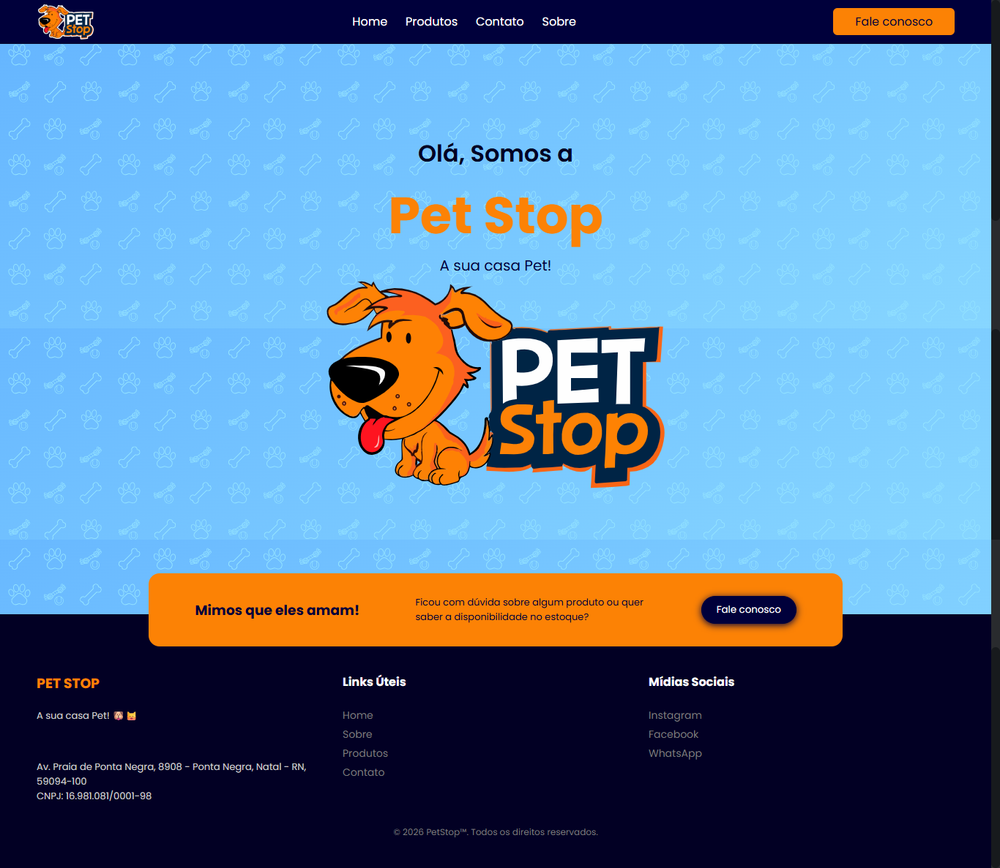

🐾 Pet Stop - Site Institucional
Este é o repositório do site oficial da Pet Stop, a sua casa Pet em Natal/RN. O projeto foi desenvolvido para apresentar o catálogo de produtos, serviços e facilitar o contato de clientes para cuidados com seus animais de estimação.

🚀 Tecnologias Utilizadas
O projeto foi construído focando em uma experiência visual limpa, performance e total responsividade para dispositivos móveis:

HTML5: Estrutura semântica para melhor SEO e acessibilidade.

CSS3: Estilização personalizada com foco em uma identidade visual moderna para o setor pet.

JavaScript (Vanilla): Lógica para navegação, interação com elementos da interface e integração de links.

SVG: Utilização de vetores para logotipos e ícones, garantindo nitidez em qualquer resolução.

Google Fonts: Tipografia selecionada para transmitir acolhimento e profissionalismo.

📂 Estrutura do Projeto
O site é organizado de forma modular para facilitar a manutenção:

/: Página inicial (Home) com destaques e apresentação.

/sobre/: História e missão da Pet Stop.

/produtos/: Galeria de mimos e produtos disponíveis em estoque.

/contato/: Informações de localização e canais de atendimento.

/assets/: Imagens, logos (SVG) e recursos visuais.

✨ Funcionalidades
Catálogo de Produtos: Visualização dos itens disponíveis para cães e gatos.

Design Responsivo: Interface adaptada para smartphones, tablets e desktops.

Integração com WhatsApp: Botões de ação direta para consulta de disponibilidade e suporte ao cliente.

Informações de Localização: Endereço físico detalhado em Ponta Negra, Natal/RN.

🛠️ Como executar localmente
Clone este repositório:

Bash
git clone https://github.com/petstop-natal/petstop
Navegue até a pasta do projeto.

Abra o arquivo index.html em seu navegador de preferência.

📧 Contato
Endereço: Av. Praia de Ponta Negra, 8908 - Ponta Negra, Natal - RN.

Instagram: @petstoprn

WhatsApp: (84) 98191-1313

Desenvolvido por: BricioDev

© 2026 Pet Stop™. Todos os direitos reservados.

Screenshot
Aqui está uma captura de tela do projeto:

